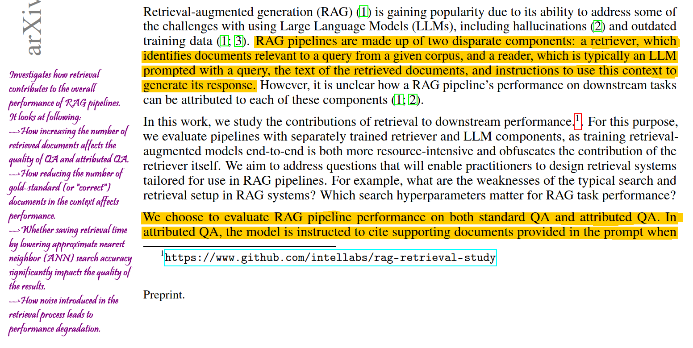

# annotated-ml-papers

A collaborative repository for sharing and annotating ML research papers. Let's make learning easier for everyone!



## Step by Step Guide to Contribute

1. **Fork the Repository**
   - Visit the GitHub page for the repository: [GDGSurrey/annotated-ml-papers](https://github.com/GDGSurrey/annotated-ml-papers).
   - Click the "Fork" button at the top right to create a copy of the repository in your own account.

2. **Setup Your Local Environment**
   - After forking, go to your forked repository.
   - Clone it to your local machine:
     ```
     git clone https://github.com/your-username/annotated-ml-papers.git
     ```
   - Replace `your-username` with your GitHub username.

3. **Create and Prepare Your Branch**
   - Change directory to the cloned repository:
     ```
     cd annotated-ml-papers
     ```
   - Create a new branch:
     ```
     git checkout -b <branch-name>
     ```

4. **Add Your Annotated Paper**
   - Add your annotated paper to the designated folder.
   - Stage and commit your changes:
     ```
     git add .
     git commit -m "Add annotated paper: <Paper Title>"
     ```

5. **Push and Create a Pull Request**
   - Push your branch:
     ```
     git push origin <branch-name>
     ```
   - Go to the original GDGSurrey repository and start a pull request.

## Review and Selection Process

- Multiple submissions may be reviewed for each session.
- The best paper, chosen for its clarity and insight, will be merged into the main branch.

## Importance of Annotating Papers

- **Enhanced Understanding**: Deepens engagement with complex concepts.
- **Community Contribution**: Shares knowledge, facilitating collaborative learning.
- **Skill Showcase**: Enhances participant profiles through demonstrated analytical skills..

## Benefits to the Community

- **Repository as a Learning Resource**: Becomes a rich hub for ML research.
- **Recognition and Motivation**: Motivates high-quality contributions and learning.

